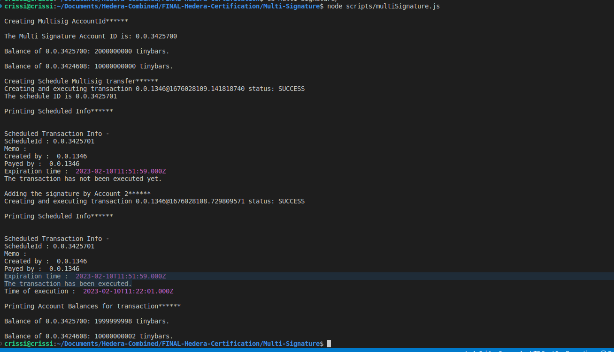

# Task : Multi Signature

Create a scheduled transaction with a key list with 3 key
(Account1, Account2 and Account3) that requires 2 of the three
keys.

Sign the transaction with Account1. Get the information of the
transaction and show that it has not yet been executed.

Sign the transaction with Account2 and get the information again
to show that it has been executed.
## Instructions

1. `npm i` to install dependent packages
2. Add missing values to `sample.env` and change its name to `.env`

3. To run the script `node scripts/multiSigAccountSuccessCase.js` and `node scripts/multiSigAccountFailureCase.js`
4. Sample output
   
