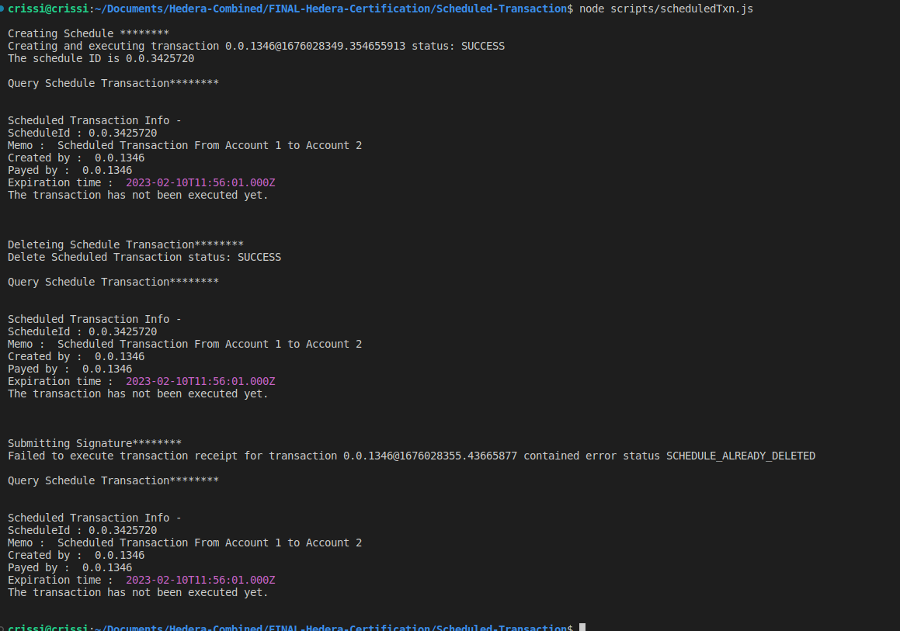

# Task : Scheduled Transaction

Create a script that creates a scheduled transaction of 2 hbar from
Account1 to Account2.

Make a second script that deletes the transaction.
Print out the schedule information along the way along with the
proof that the transfer did not happen.
Try to execute the transaction and show that it does not work.

## Instructions

1. `npm i` to install dependent packages
2. Add missing values to `sample.env` and change its name to `.env`

3. To run the script `node scripts/scheduledTxn.js`
4. Sample output
   
