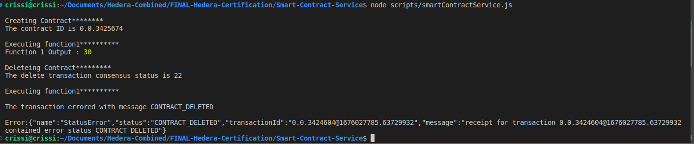

# Task : Smart Contract Service

Compile the Solidity contract given below using
Account1 and deploy it to the Hedera Network using
the HCS with the ContractCreateFlow method. Write a
script to call “function1” with the parameters 5 and 6.
Gather the result and display it in the output.
Delete the smart contract.

## Instructions

1. `npm i` to install dependent packages
2. Add missing values to `sample.env` and change its name to `.env`

3. To run the script `node scripts/smartContractService.js`
4. Sample output
   
