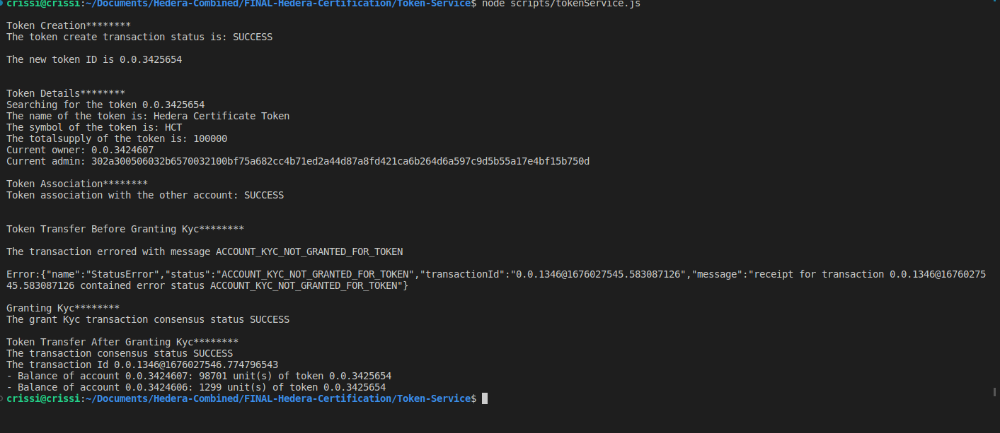

# Task : Token Service

Create a script that generates a fungible token that requires a KYC
process to be completed.

Set a fixed supply of 1000. Associate Account3, but do not KYC it.
Try to send 12.99 tokens from Account2 to Account3.

Show that the account is not yet able to participate in the token
because it is not been KYC approved.

Now set the KYC flag on Account3 and retry the transfer.

## Instructions

1. `npm i` to install dependent packages
2. Add missing values to `sample.env` and change its name to `.env`

3. To run the script `node scripts/tokenService.js`
4. Sample output
   
